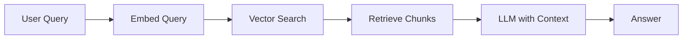

# AI Engineering Learning Hub

> A structured, community-driven knowledge base for AI engineering — covering concepts, architectures, patterns, and hands-on examples.

---

## Table of Contents

- [What This Repo Is For](#what-this-repo-is-for)
- [Repository Structure](#repository-structure)
- [How to Contribute Content](#how-to-contribute-content)
  - [1. Topic Articles](#1-topic-articles)
  - [2. Practical Examples & Code](#2-practical-examples--code)
  - [3. Images & Diagrams](#3-images--diagrams)
  - [4. Notebooks](#4-notebooks)
- [Content Style Guide](#content-style-guide)
- [Submission Checklist](#submission-checklist)
- [Getting Started Locally](#getting-started-locally)

---

## What This Repo Is For

This repository is a structured learning resource for engineers building AI-powered systems. It covers:

- **Foundations** — LLMs, embeddings, vector databases, tokenization
- **Patterns** — RAG, agents, tool use, prompt engineering, fine-tuning
- **Architectures** — multi-agent systems, evaluation pipelines, deployment patterns
- **Practical Examples** — annotated code, notebooks, real use cases

---

## Repository Structure

```
ai-engineering-learning/
│
├── README.md                        ← You are here
│
├── topics/                          ← Conceptual articles by topic
│   ├── foundations/
│   │   ├── llm-basics.md
│   │   ├── embeddings.md
│   │   └── tokenization.md
│   ├── patterns/
│   │   ├── rag.md
│   │   ├── agents.md
│   │   └── prompt-engineering.md
│   └── architectures/
│       ├── multi-agent-systems.md
│       └── evaluation-pipelines.md
│
├── examples/                        ← Runnable code examples
│   ├── rag-basic/
│   │   ├── README.md                ← Must explain what it does + how to run
│   │   ├── main.py
│   │   └── requirements.txt
│   └── agent-with-tools/
│       ├── README.md
│       └── index.ts
│
├── notebooks/                       ← Jupyter/Colab notebooks
│   └── rag-from-scratch.ipynb
│
└── assets/
    └── images/                      ← All images/diagrams referenced in articles
        ├── rag-architecture.png
        └── agent-loop.png
```

---

## How to Contribute Content

### 1. Topic Articles

Each topic lives in `topics/<category>/<topic-name>.md`.

**File naming:** Use lowercase kebab-case. Example: `prompt-engineering.md`

**Article structure:**

```markdown
# Topic Title

> One-line summary of what this topic covers.

## What Is It?
<!-- Plain-language explanation. Assume the reader is an engineer, not an AI researcher. -->

## Why It Matters
<!-- Practical motivation. When would you use this? What problems does it solve? -->

## How It Works
<!-- Explain the mechanism. Use diagrams here (see Images section below). -->


*Caption: Brief description of what the diagram shows.*

## Key Concepts
<!-- Bullet list or subsections for important terms/ideas. -->

- **Concept A** — definition
- **Concept B** — definition

## Practical Example
<!-- Minimal working code snippet that demonstrates the concept. -->

```python
# Example: basic embedding lookup
from openai import OpenAI
client = OpenAI()

response = client.embeddings.create(
    input="AI engineering is fascinating",
    model="text-embedding-3-small"
)
print(response.data[0].embedding[:5])
```

## Common Pitfalls
<!-- What mistakes do people make? What should they watch out for? -->

## Further Reading
<!-- 2–5 links max. Prefer official docs and high-quality papers/posts. -->

- [Title](https://link)
```

---

### 2. Practical Examples & Code

Each example lives in its own folder under `examples/<example-name>/`.

**Every example folder must contain:**

| File | Purpose |
|------|---------|
| `README.md` | What it does, prerequisites, how to run it |
| Source files | Actual runnable code |
| `requirements.txt` / `package.json` | Dependency file |

**Example README structure:**

```markdown
# Example: Basic RAG Pipeline

## What This Demonstrates
A minimal retrieval-augmented generation pipeline using OpenAI + a local vector store.

## Prerequisites
- Python 3.10+
- OpenAI API key set as `OPENAI_API_KEY`

## Setup & Run

```bash
pip install -r requirements.txt
python main.py
```

## How It Works
1. Documents are chunked and embedded into a vector store
2. A user query is embedded and matched against stored chunks
3. Top matches are passed as context to the LLM

## Expected Output
```
Query: "What is RAG?"
Answer: "Retrieval-Augmented Generation is a pattern where..."
```
```

**Code quality rules:**
- Add inline comments for non-obvious logic
- Keep examples focused — one concept per example
- Use environment variables for API keys, never hardcode them
- Include a `.env.example` if your example needs env vars

---

### 3. Images & Diagrams

All images go in `assets/images/`. Reference them with relative paths.

**Naming:** `<topic>-<description>.png` — e.g., `rag-architecture.png`, `agent-tool-loop.png`

**Recommended diagramming tools:**
- [Excalidraw](https://excalidraw.com) — hand-drawn style, great for architecture diagrams
- [draw.io / diagrams.net](https://app.diagrams.net) — professional flowcharts
- [Mermaid](https://mermaid.js.org) — diagrams-as-code, renders in GitHub Markdown

**Using Mermaid (no image file needed):**

````markdown

````

**Image guidelines:**
- Export at 2x resolution for retina displays (minimum 1200px wide for architecture diagrams)
- Use PNG for diagrams, JPG only for photos
- Keep file size under 500KB — compress with [Squoosh](https://squoosh.app) if needed
- Always add a caption below the image explaining what it shows

---

### 4. Notebooks

Notebooks go in `notebooks/`. They should be self-contained and runnable top-to-bottom.

**Requirements:**
- Add a "Open in Colab" badge at the top
- Clear all cell outputs before committing (avoids large diffs)
- Each major section should have a markdown cell explaining what it does
- Include a `## Setup` cell at the top with all installs

**Colab badge template:**

```markdown
[](https://colab.research.google.com/github/ini8labs/ai-engineering-learning/blob/main/notebooks/your-notebook.ipynb)
```

---

## Content Style Guide

| Rule | Good | Bad |
|------|------|-----|
| Tone | Clear, direct, engineer-to-engineer | Overly formal or academic |
| Code snippets | Minimal, runnable, commented | Long, unexplained, pseudo-code |
| Diagrams | One diagram per major concept | No diagrams for architectural topics |
| Length | As long as needed, no longer | Padding, repetition, filler |
| Terminology | Define terms on first use | Assume reader knows jargon |
| Links | 2–5 per article, high-quality sources | Link dumps, low-quality blogs |

---

## Submission Checklist

Before opening a PR, confirm:

- [ ] File is in the correct folder (`topics/`, `examples/`, `notebooks/`)
- [ ] File named in lowercase kebab-case
- [ ] Article follows the structure template above
- [ ] All images are in `assets/images/` and referenced with relative paths
- [ ] Images have captions
- [ ] Code examples are runnable and tested
- [ ] No API keys or secrets hardcoded
- [ ] Links are valid (not 404)
- [ ] Notebook outputs cleared before committing

---

## Getting Started Locally

```bash
# Clone the repo
git clone https://github.com/ini8labs/ai-engineering-learning.git
cd ai-engineering-learning

# Create a branch for your contribution
git checkout -b add/rag-article

# Make your changes, then push and open a PR
git add .
git commit -m "add: RAG fundamentals article"
git push origin add/rag-article
```

---

> Questions or suggestions? Open an issue or start a discussion.
